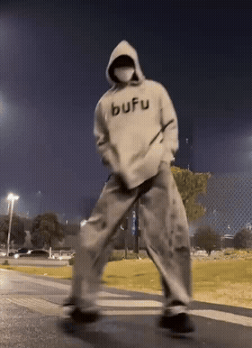
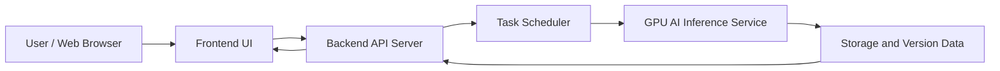
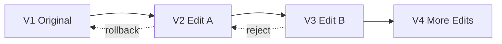
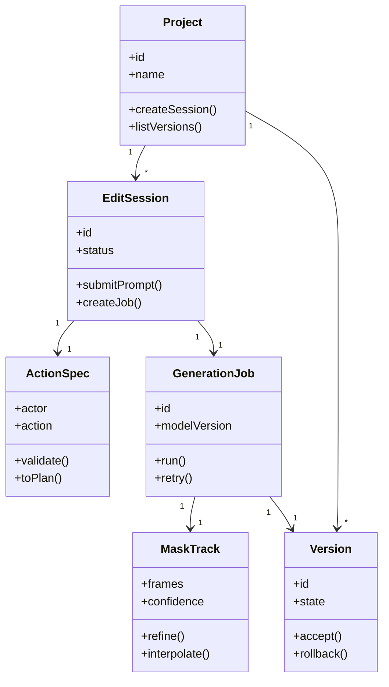

# VCME: Vibe Character Motion Editor

> 自然語言影片人物動作編輯系統  
> Natural Language Video Character Motion Editing System

VCME（Vibe Character Motion Editor）是一套以大型 AI 模型為基礎的互動式影片人物動作編輯系統。使用者可以在網頁中上傳影片、點選欲編輯的人物，並以自然語言輸入動作指令，系統會依序完成目標人物追蹤、遮罩生成、動作規劃、動作生成、背景補洞、結果合成與版本管理。

本專題重點不在重新訓練大型模型，而是設計一套可落地實作、可追溯、可版本管理的 AI 影片人物編輯流程與系統架構。

**[主成果展示](#main-results) · [VACE 影片比較](#comparison-with-vace) · [更多實驗](#additional-results) · [系統架構](#system-architecture)**

<a id="main-results"></a>
## Main Results｜我們的影片成果

**Ours — StoryMem + Wan2.2（V40）**

V40 為目前資料夾標示的主成果與動作基準，優先用於專題展示。點擊下方動態預覽可開啟完整 MP4。

<p align="center">
  <a href="videos/01_主要成果/01_V40_StoryMem_Wan22_主成果_動作最佳基準.mp4">
    
  </a>
</p>

<p align="center"><a href="videos/01_主要成果/01_V40_StoryMem_Wan22_主成果_動作最佳基準.mp4">▶ 觀看我們的完整影片（V40）</a></p>

| 主成果 | 最新候選 |
| :---: | :---: |
| **V40 · StoryMem + Wan2.2** | **V63 · 低位移端點／局部遮罩** |
| [觀看完整影片](videos/01_主要成果/01_V40_StoryMem_Wan22_主成果_動作最佳基準.mp4) | [觀看完整影片](videos/01_主要成果/02_V63_低位移端點_局部遮罩_最新候選.mp4) |
| 目前主要展示版本 | 補充實驗版本，尚未取代 V40 主成果定位 |

<a id="comparison-with-vace"></a>
## Comparison with VACE｜影片比較

以下採用論文專案常見的 **Input / Baseline / Ours** 呈現方式，並列原始影片、VACE 對照影片與我們的主成果，方便觀察人物動作、外觀保留、背景變化與時間連續性。

| Input · 原始影片 | VACE · ContextBridge V31 | Ours · StoryMem + Wan2.2 V40 |
| :---: | :---: | :---: |
| [](videos/00_原始影片/00_原始影片.mp4) | [](videos/PLAY_THIS_VACE_ContextBridge_v31.mp4) | [](videos/01_主要成果/01_V40_StoryMem_Wan22_主成果_動作最佳基準.mp4) |
| [▶ 完整原片](videos/00_原始影片/00_原始影片.mp4) | [▶ VACE 完整影片](videos/PLAY_THIS_VACE_ContextBridge_v31.mp4) | [▶ 我們的完整影片](videos/01_主要成果/01_V40_StoryMem_Wan22_主成果_動作最佳基準.mp4) |

**比較版本與條件。** 本頁 VACE 欄使用 `videos/PLAY_THIS_VACE_ContextBridge_v31.mp4`，屬於本地 ContextBridge V31 對照影片；並非 VACE 官方網站的展示影片，也不代表官方 benchmark 成績。Ours 使用檔名標示為 StoryMem + Wan2.2 的 V40。兩段輸出均為 448 × 616、約 11.17 秒；VACE 為 24 fps，V40 為 30 fps。GIF 僅供快速預覽，統一以 10 fps 縮圖呈現，保留原始播放時長；精細畫質與流暢度請以 MP4 為準，個別 GIF 不保證同步播放。

### Method Comparison｜方法定位

| 比較項目 | VACE | Ours / VCME |
| --- | --- | --- |
| 研究定位 | 通用影片創作與編輯模型，支援參考生成、影片編輯與遮罩影片編輯 | 自然語言人物動作編輯系統，聚焦人物選取、動作修改與結果版本管理 |
| 本頁展示版本 | 本地 VACE ContextBridge V31 | StoryMem + Wan2.2 V40 主成果 |
| 補充版本 | V31 Context 對照、V33 StoryMem 動作條件 + VACE 生成 | V63 低位移端點／局部遮罩候選 |
| 本頁比較方式 | 與原始影片及 Ours 並列做視覺比較 | 與原始影片及 VACE 並列做視覺比較 |

VACE 的方法介紹以[官方 GitHub](https://github.com/ali-vilab/VACE)與[論文](https://arxiv.org/abs/2503.07598)為依據；本地版本名稱以影片檔名為依據。下方系統架構描述為 VCME 的整體設計，不等同於每支實驗影片已實作的完整流程。

### What to Compare｜觀察重點

| 面向 | 比較時觀察的內容 |
| --- | --- |
| 人物動作 | 動作幅度、姿態是否自然，以及肢體是否變形 |
| 人物外觀 | 臉部、服裝與身形是否在編輯前後保持一致 |
| 背景保留 | 非編輯區域是否穩定，原人物位置是否出現殘影或修補痕跡 |
| 時間一致性 | 連續影格是否閃爍、跳動，人物與背景邊界是否穩定 |

目前資料夾未附各版本的 prompt、seed、遮罩與推論設定，也未提供量化評測，因此此處呈現定性影片對照，不宣稱已在相同實驗條件下優於 VACE。

<a id="additional-results"></a>
## Additional Results｜更多實驗影片

<details>
<summary><strong>V63 最新候選影片</strong></summary>

[](videos/01_主要成果/02_V63_低位移端點_局部遮罩_最新候選.mp4)

[▶ 觀看 V63 完整影片](videos/01_主要成果/02_V63_低位移端點_局部遮罩_最新候選.mp4)

</details>

<details>
<summary><strong>技術對照與歷史版本</strong></summary>

| 版本 | 實驗定位 | 影片 |
| --- | --- | --- |
| V19 | 早期 StoryMem 基準 | [觀看](videos/02_技術對照/01_V19_早期StoryMem基準.mp4) |
| V24 | 人物動作歷史最佳（依檔名標示） | [觀看](videos/02_技術對照/02_V24_人物動作歷史最佳.mp4) |
| V26 | 背景歷史最佳（依檔名標示） | [觀看](videos/02_技術對照/03_V26_背景歷史最佳.mp4) |
| V31 | VACE Context 對照，非主架構；與上方 VACE 展示檔為不同檔案 | [觀看](videos/02_技術對照/04_V31_VACE_Context對照_非主架構.mp4) |
| V33 | StoryMem 動作條件 + VACE 生成，研究對照 | [觀看](videos/02_技術對照/05_V33_StoryMem動作條件加VACE生成_研究對照.mp4) |
| V52 | V40 可重現基線（依檔名標示） | [觀看](videos/02_技術對照/06_V52_V40可重現基線.mp4) |
| V57 | V40 人物 + 外部光流背景修復，非重新生成 | [觀看](videos/03_外部修復研究/01_V57_V40人物加外部光流背景修復_非重新生成.mp4) |

</details>

## Table of Contents

- [Main Results｜主成果](#main-results)
- [Comparison with VACE｜影片比較](#comparison-with-vace)
- [Additional Results｜更多實驗](#additional-results)
- [Project Overview](#project-overview)
- [Key Features](#key-features)
- [System Architecture](#system-architecture)
- [AI Pipeline](#ai-pipeline)
- [Version Management](#version-management)
- [UML Class Design](#uml-class-design)
- [Repository Structure](#repository-structure)
- [Technology Stack](#technology-stack)
- [Planned API Design](#planned-api-design)
- [Getting Started](#getting-started)
- [Project Scope](#project-scope)
- [References](#references)
- [Team Members](#team-members)

## Project Overview

傳統影片編輯需要大量人工操作，例如逐格遮罩、人物去背、動作重建、背景修補與多版本管理。VCME 希望將這些工作整理成一個自然語言驅動的互動流程：

1. 使用者上傳影片。
2. 使用者點選欲修改的人物。
3. 使用者輸入自然語言指令。
4. 系統解析指令並產生動作規劃。
5. AI pipeline 生成修改後的影片。
6. 使用者預覽、接受、退回或回復版本。

範例指令：

```text
讓這個人站起來揮手
讓人物往左走三步
讓人物轉身後跳躍
讓他站起來，並在空中轉身
```

## Key Features

### Natural Language Editing

使用者可以直接以文字描述想要修改的動作。系統會將自然語言轉換為結構化的動作需求，例如目標人物、動作類型、移動方向、時間範圍與生成限制。

### Character Selection and Tracking

使用者在影片中點選目標人物後，系統透過 SAM 2 進行影片物件分割與跨影格追蹤，產生人物遮罩序列，作為後續動作生成與背景合成的條件。

### AI Motion Generation

系統根據使用者指令與人物遮罩，結合 MotionEditor 類型的動作生成流程，嘗試保留人物身份、外觀、背景內容與時間一致性。

### Inpainting and Composition

當人物位置或姿態被修改後，原本人物所在位置可能留下背景缺口。系統透過 ObjectMover 類型的背景補洞與合成流程，產生最終影片結果。

### Traceable Version Control

每次生成都建立新版本，不直接覆蓋原始影片。使用者可以預覽結果、接受版本、退回結果，或回復到上一個已接受版本。

## System Architecture

VCME 採用前後端分離與背景任務排程架構。使用者端只負責瀏覽器操作，影片處理與 AI 生成任務則由後端與 GPU 推論服務負責。



主要模組：

| Module | Responsibility |
| --- | --- |
| Frontend | 影片上傳、人物點選、指令輸入、結果比較 |
| Backend | API、專案管理、任務管理、版本管理 |
| AI Pipeline | 人物追蹤、指令解析、動作生成、背景補洞與合成 |
| Storage | 原始影片、遮罩資料、輸出影片、任務紀錄與版本資料 |

## AI Pipeline

VCME 的 AI pipeline 參考 SAM 2、VIRES、MotionEditor 與 ObjectMover 的研究概念，將自然語言影片人物動作編輯拆成四個主要階段。

### Step 1: Character Tracking

Model: SAM 2

目的：

- 影片人物分割
- 跨影格目標追蹤
- 產生人物遮罩序列

輸入：

- 原始影片 `V`
- 使用者點選位置或框選範圍 `P`

輸出：

- 人物遮罩序列 `M`
- 追蹤信心分數

### Step 2: Instruction Parsing

Model: VIRES-inspired parser

目的：

- 解析自然語言指令
- 建立結構化動作需求
- 產生 motion plan

輸入：

- 使用者文字指令 `T`
- 人物遮罩序列 `M`

輸出：

- `ActionSpec`
- `Action Embedding`
- `Motion Plan`

### Step 3: Motion Generation

Model: MotionEditor-inspired generation

目的：

- 根據文字指令修改人物動作
- 保留人物外觀與身份一致性
- 維持影片時間連續性

輸入：

- 原始影片
- 人物遮罩
- 動作規劃

輸出：

- 編輯後人物影片片段

### Step 4: Inpainting and Composition

Model: ObjectMover-inspired composition

目的：

- 修補背景缺口
- 合成生成後人物與背景
- 輸出最終影片

輸出：

- Final Video
- Version Metadata

## Version Management

VCME 將每次生成視為一個可追溯版本，避免直接覆蓋原始影片。



版本欄位設計：

| Field | Description |
| --- | --- |
| `version_id` | 版本編號 |
| `parent_version_id` | 上一版本 |
| `project_id` | 所屬專案 |
| `prompt` | 使用者輸入的自然語言指令 |
| `model_version` | 使用的模型或 pipeline 版本 |
| `status` | `preview`, `accepted`, `rejected`, `failed` |
| `video_url` | 輸出影片位置 |
| `created_at` | 建立時間 |

## UML Class Design

核心物件包含 `Project`、`EditSession`、`ActionSpec`、`GenerationJob`、`MaskTrack` 與 `Version`。



## Repository Structure

目前資料夾以成果影片與專題系統設計說明為主，主要展示入口為本 README。

```text
報告影片/
├── readme.md
├── videos/                              # README 引用的影片副本
│   ├── PLAY_THIS_VACE_ContextBridge_v31.mp4
│   ├── 00_原始影片/                      # 輸入影片
│   ├── 01_主要成果/                      # V40 主成果、V63 候選
│   ├── 02_技術對照/                      # V19 / V24 / V26 / V31 / V33 / V52
│   └── 03_外部修復研究/                  # V57 外部光流修復
├── assets/previews/                      # README 動態預覽 GIF
├── PLAY_THIS_VACE_ContextBridge_v31.mp4   # 保留的原檔
├── 00_原始影片/                          # 保留的原檔
├── 01_主要成果/                          # 保留的原檔
├── 02_技術對照/                          # 保留的原檔
└── 03_外部修復研究/                      # 保留的原檔
```

README 的影片連結統一指向 `videos/` 內的副本，並保留原有分類與檔名。GIF 為縮小的展示副本，完整品質請觀看連結的 MP4。分享此 README 時，請一併提供 `videos/` 與 `assets/previews/`。

## Technology Stack

### Frontend

- React
- HTML5
- CSS3
- JavaScript

### Backend

- Python
- FastAPI
- Background task scheduler
- RESTful API

### AI Models

| Model | Role |
| --- | --- |
| SAM 2 | 人物分割、影片物件追蹤、遮罩生成 |
| VIRES | 指令解析、動作規劃 |
| MotionEditor | 人物動作編輯與生成 |
| ObjectMover | 背景補洞、結果合成 |

### Storage

- Original videos
- Mask sequences
- Generated videos
- Job logs
- Version metadata

## Planned API Design

以下為規劃中的 API 介面，實際路由可依後端實作調整。

| Method | Endpoint | Description |
| --- | --- | --- |
| `POST` | `/projects` | 建立專案 |
| `POST` | `/projects/{project_id}/videos` | 上傳原始影片 |
| `POST` | `/projects/{project_id}/sessions` | 建立編輯工作階段 |
| `POST` | `/sessions/{session_id}/select-character` | 送出人物點選位置 |
| `POST` | `/sessions/{session_id}/prompt` | 送出自然語言指令 |
| `POST` | `/jobs` | 建立 AI 生成任務 |
| `GET` | `/jobs/{job_id}` | 查詢任務狀態 |
| `GET` | `/projects/{project_id}/versions` | 取得版本列表 |
| `POST` | `/versions/{version_id}/accept` | 接受版本 |
| `POST` | `/versions/{version_id}/rollback` | 回復版本 |

## Getting Started

目前此 repository 仍以系統設計與專題文件為主，尚未包含可直接執行的前端、後端與 AI pipeline 程式碼。若後續補上完整專案，可使用以下方式啟動。

### Clone Repository

```bash
git clone https://github.com/your-account/VCME.git
cd VCME
```

### Backend

```bash
pip install -r requirements.txt
uvicorn main:app --reload
```

### Frontend

```bash
npm install
npm run dev
```

## Project Scope

### Current Scope

- 完成 VCME 系統架構設計
- 完成 AI pipeline 流程設計
- 完成核心物件與 UML class design
- 完成版本管理與資料追溯設計
- 完成專題簡報與 README 文件整理

### MVP Scope

- 支援單一角色編輯
- 支援短影片片段
- 支援人物點選與遮罩追蹤
- 支援自然語言動作指令
- 支援預覽、接受、退回與回復版本

### Out of Scope

- 不重新訓練大型 AI 模型
- 不處理長影片完整剪輯工作流
- 不保證多人物複雜互動場景的穩定生成
- 不取代專業非線性剪輯軟體

## Expected Results

VCME 預期能展示一套完整的自然語言影片人物動作編輯流程：

- 使用者能透過網頁介面完成影片上傳與人物選取。
- 系統能將文字指令轉換為可執行的 AI 生成任務。
- 生成結果能保留原人物外觀與影片背景一致性。
- 每次結果都能被記錄為版本，並支援回復與追溯。

## References

- Jiang et al., **VACE: All-in-One Video Creation and Editing**, ICCV 2025. [Paper](https://arxiv.org/abs/2503.07598) · [Code](https://github.com/ali-vilab/VACE)
- README 影片展示編排參考：[DFVEdit](https://github.com/LinglingCai0314/DFVEdit) 的 Visual Results / Video Demos 分區。
- Ravi et al., **SAM 2: Segment Anything in Images and Videos**, arXiv:2408.00714, 2024.
- Tu et al., **MotionEditor**, CVPR 2024.
- Weng et al., **VIRES**, CVPR 2025.
- Yu et al., **ObjectMover**, CVPR 2025.

## Team Members

指導教授：

- 陳仁暉 教授

專題成員：

- 洪碩廷
- 顏羽婕
- 黃靖芳
- 彭暉紘
- 王俊傑

## Project Document

專題設計簡報 `VCME-signed(2).pdf` 尚未收錄於此影片資料夾。
