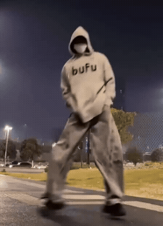
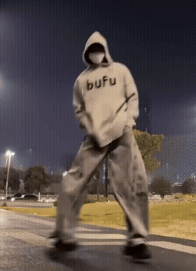
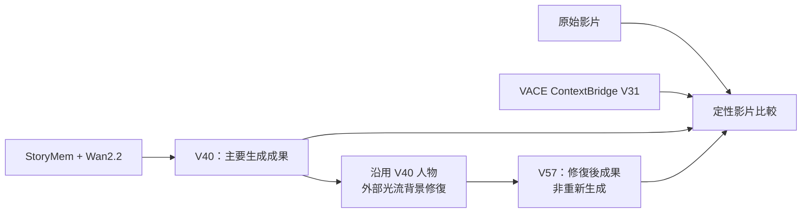
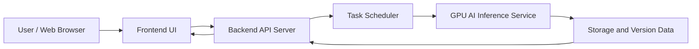
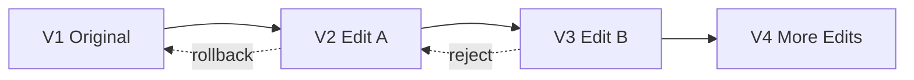
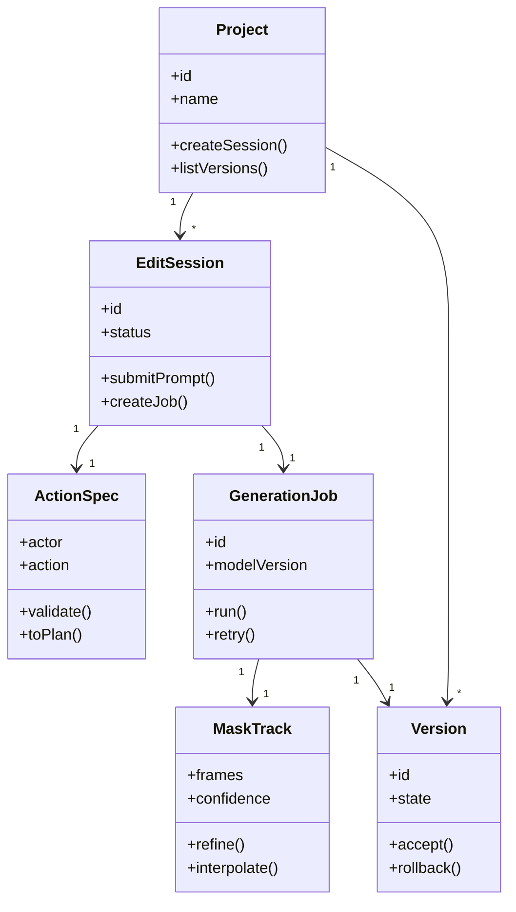

# VCME: Vibe Character Motion Editor

> 自然語言影片人物動作編輯系統  
> Natural Language Video Character Motion Editing System

VCME（Vibe Character Motion Editor）是一套以大型 AI 模型為基礎的互動式影片人物動作編輯系統。使用者可以在網頁中上傳影片、點選欲編輯的人物，並以自然語言輸入動作指令，系統會依序完成目標人物追蹤、遮罩生成、動作規劃、動作生成、背景補洞、結果合成與版本管理。

本專題重點不在重新訓練大型模型，而是設計一套可落地實作、可追溯、可版本管理的 AI 影片人物編輯流程與系統架構。

<!-- BEGIN ADDED RESULTS -->
## Video Results｜影片成果與 VACE 比較

[主要成果](#main-result) · [VACE 與我們的影片比較](#vace-comparison) · [最新實驗流程](#current-workflow) · [原始系統設計](#system-architecture)

本區新增目前的影片成果與實驗流程；後方原始 README 的架構圖片、系統設計、UML、API 規劃與團隊資訊完整保留。原始模型組合屬於先前設計，以下 V40／V57 說明對應目前展示的實驗版本。

<a id="main-result"></a>
### Main Result · 我們的主成果 V40

<p align="center">
  <a href="videos/01_主要成果/01_V40_StoryMem_Wan22_主成果_動作最佳基準.mp4"></a>
</p>
<p align="center"><strong>Ours · StoryMem + Wan2.2 · V40</strong><br><a href="videos/01_主要成果/01_V40_StoryMem_Wan22_主成果_動作最佳基準.mp4">▶ 觀看完整影片</a></p>

<a id="vace-comparison"></a>
### Qualitative Comparison · 原片、VACE 與我們的成果

<table>
  <thead>
    <tr>
      <th align="center">Input · 原始影片</th>
      <th align="center">VACE · ContextBridge V31</th>
      <th align="center">Ours · V40</th>
      <th align="center">Ours · V57</th>
    </tr>
  </thead>
  <tbody>
    <tr>
      <td align="center"><a href="videos/00_原始影片/00_原始影片.mp4"></a></td>
      <td align="center"><a href="videos/PLAY_THIS_VACE_ContextBridge_v31.mp4"></a></td>
      <td align="center"><a href="videos/01_主要成果/01_V40_StoryMem_Wan22_主成果_動作最佳基準.mp4"></a></td>
      <td align="center"><a href="videos/03_外部修復研究/01_V57_V40人物加外部光流背景修復_非重新生成.mp4"></a></td>
    </tr>
    <tr>
      <td align="center">編輯前的輸入</td>
      <td align="center">本地 VACE 對照版本</td>
      <td align="center">StoryMem + Wan2.2</td>
      <td align="center">V40 人物 + 外部光流背景修復</td>
    </tr>
    <tr>
      <td align="center"><a href="videos/00_原始影片/00_原始影片.mp4">▶ 完整原片</a></td>
      <td align="center"><a href="videos/PLAY_THIS_VACE_ContextBridge_v31.mp4">▶ VACE 完整影片</a></td>
      <td align="center"><a href="videos/01_主要成果/01_V40_StoryMem_Wan22_主成果_動作最佳基準.mp4">▶ V40 完整影片</a></td>
      <td align="center"><a href="videos/03_外部修復研究/01_V57_V40人物加外部光流背景修復_非重新生成.mp4">▶ V57 完整影片</a></td>
    </tr>
  </tbody>
</table>

GIF 會循環播放，點擊可開啟完整 MP4。所有預覽統一以 10 fps、相同寬度製作，保留原播放速度；個別 GIF 不保證逐格同步，精細畫質與流暢度請以 MP4 為準。

| 比較版本 | 方法與定位 | 觀察重點 |
| --- | --- | --- |
| Input | 原始影片 | 人物外觀、原始動作與場景 |
| VACE · V31 | 本地 ContextBridge 對照版本 | 動作表現、外觀保留與背景變化 |
| Ours · V40 | StoryMem + Wan2.2，主要生成成果 | 人物動作、身份與服裝保留、時間連續性 |
| Ours · V57 | 沿用 V40 人物，加入外部光流背景修復，非重新生成 | 背景穩定性、人物邊界與修復痕跡 |

VACE 欄使用本地 `PLAY_THIS_VACE_ContextBridge_v31.mp4` 的副本，不是官方示範片或官方 benchmark 成績；方法來源可參考 [VACE 官方專案](https://github.com/ali-vilab/VACE)。目前未附各版本完整 prompt、seed、遮罩與推論設定，此處為定性影片比較，不宣稱已在相同條件下優於 VACE。

<a id="current-workflow"></a>
### Current Workflow · 最新實驗流程補充

下圖呈現目前成果檔案可確認的版本關係：V40 為 StoryMem + Wan2.2 主成果，V57 則沿用 V40 人物進行背景修復。完整模型接線與條件輸入仍應以實作設定為準。



### Demo Assets · 新增展示檔案

```text
assets/previews/              # 首頁動態預覽
├── input.gif
├── vace-v31.gif
└── ours-v40.gif
VCME_GitHub_上傳資料/assets/previews/
└── v57.gif                   # 沿用目前已上傳的位置
videos/                       # 完整影片沿用既有位置
├── 00_原始影片/00_原始影片.mp4
├── PLAY_THIS_VACE_ContextBridge_v31.mp4
├── 01_主要成果/01_V40_StoryMem_Wan22_主成果_動作最佳基準.mp4
└── 03_外部修復研究/01_V57_V40人物加外部光流背景修復_非重新生成.mp4
```

本頁預覽沿用 repository 現有的檔名與位置。更新時只需替換根目錄的 `Readme.md`；請保留 `assets/previews/`、`VCME_GitHub_上傳資料/assets/previews/`、`videos/` 與 `docs/`。

### Available Documents · 現有專題文件

- [第一次書面報告](VCME_GitHub_上傳資料/VCME-第一次書面報告.pdf)
- [第二次書面報告](VCME_GitHub_上傳資料/VCME-第二次書面報告.pdf)
- [完整系統分析與設計文件](VCME_GitHub_上傳資料/VCME_自然語言影片人物動作編輯系統：完整系統分析與設計文件.pdf)
- [VCME 詞彙表](VCME_GitHub_上傳資料/VCME詞彙表.pdf)

原始 README 下方引用的 `VCME-signed(2).pdf` 未包含在目前 repository；原文連結保留，現有文件可從上方開啟。

---

<!-- END ADDED RESULTS -->


## Table of Contents

- [Project Overview](#project-overview)
- [Key Features](#key-features)
- [System Architecture](#system-architecture)
- [AI Pipeline](#ai-pipeline)
- [Version Management](#version-management)
- [UML Class Design](#uml-class-design)
- [Repository Structure](#repository-structure)
- [Technology Stack](#technology-stack)
- [Planned API Design](#planned-api-design)
- [Getting Started](#getting-started)
- [Project Scope](#project-scope)
- [References](#references)
- [Team Members](#team-members)

## Project Overview

傳統影片編輯需要大量人工操作，例如逐格遮罩、人物去背、動作重建、背景修補與多版本管理。VCME 希望將這些工作整理成一個自然語言驅動的互動流程：

1. 使用者上傳影片。
2. 使用者點選欲修改的人物。
3. 使用者輸入自然語言指令。
4. 系統解析指令並產生動作規劃。
5. AI pipeline 生成修改後的影片。
6. 使用者預覽、接受、退回或回復版本。

範例指令：

```text
讓這個人站起來揮手
讓人物往左走三步
讓人物轉身後跳躍
讓他站起來，並在空中轉身
```

## Key Features

### Natural Language Editing

使用者可以直接以文字描述想要修改的動作。系統會將自然語言轉換為結構化的動作需求，例如目標人物、動作類型、移動方向、時間範圍與生成限制。

### Character Selection and Tracking

使用者在影片中點選目標人物後，系統透過 SAM 2 進行影片物件分割與跨影格追蹤，產生人物遮罩序列，作為後續動作生成與背景合成的條件。

### AI Motion Generation

系統根據使用者指令與人物遮罩，結合 MotionEditor 類型的動作生成流程，嘗試保留人物身份、外觀、背景內容與時間一致性。

### Inpainting and Composition

當人物位置或姿態被修改後，原本人物所在位置可能留下背景缺口。系統透過 ObjectMover 類型的背景補洞與合成流程，產生最終影片結果。

### Traceable Version Control

每次生成都建立新版本，不直接覆蓋原始影片。使用者可以預覽結果、接受版本、退回結果，或回復到上一個已接受版本。

## System Architecture

VCME 採用前後端分離與背景任務排程架構。使用者端只負責瀏覽器操作，影片處理與 AI 生成任務則由後端與 GPU 推論服務負責。



主要模組：

| Module | Responsibility |
| --- | --- |
| Frontend | 影片上傳、人物點選、指令輸入、結果比較 |
| Backend | API、專案管理、任務管理、版本管理 |
| AI Pipeline | 人物追蹤、指令解析、動作生成、背景補洞與合成 |
| Storage | 原始影片、遮罩資料、輸出影片、任務紀錄與版本資料 |

## AI Pipeline


VCME 的 AI pipeline 參考 SAM 2、VIRES、MotionEditor 與 ObjectMover 的研究概念，將自然語言影片人物動作編輯拆成四個主要階段。

### Step 1: Character Tracking

Model: SAM 2

目的：

- 影片人物分割
- 跨影格目標追蹤
- 產生人物遮罩序列

輸入：

- 原始影片 `V`
- 使用者點選位置或框選範圍 `P`

輸出：

- 人物遮罩序列 `M`
- 追蹤信心分數

### Step 2: Instruction Parsing

Model: VIRES-inspired parser

目的：

- 解析自然語言指令
- 建立結構化動作需求
- 產生 motion plan

輸入：

- 使用者文字指令 `T`
- 人物遮罩序列 `M`

輸出：

- `ActionSpec`
- `Action Embedding`
- `Motion Plan`

### Step 3: Motion Generation

Model: MotionEditor-inspired generation

目的：

- 根據文字指令修改人物動作
- 保留人物外觀與身份一致性
- 維持影片時間連續性

輸入：

- 原始影片
- 人物遮罩
- 動作規劃

輸出：

- 編輯後人物影片片段

### Step 4: Inpainting and Composition

Model: ObjectMover-inspired composition

目的：

- 修補背景缺口
- 合成生成後人物與背景
- 輸出最終影片

輸出：

- Final Video
- Version Metadata

## Version Management

VCME 將每次生成視為一個可追溯版本，避免直接覆蓋原始影片。



版本欄位設計：

| Field | Description |
| --- | --- |
| `version_id` | 版本編號 |
| `parent_version_id` | 上一版本 |
| `project_id` | 所屬專案 |
| `prompt` | 使用者輸入的自然語言指令 |
| `model_version` | 使用的模型或 pipeline 版本 |
| `status` | `preview`, `accepted`, `rejected`, `failed` |
| `video_url` | 輸出影片位置 |
| `created_at` | 建立時間 |

## UML Class Design

核心物件包含 `Project`、`EditSession`、`ActionSpec`、`GenerationJob`、`MaskTrack` 與 `Version`。



## Repository Structure

目前此資料夾收錄專題設計 PDF 與由 PDF 匯出的 README 圖片素材。後續若進入實作階段，建議擴充為以下結構：

```text
VCME
├── frontend
│   ├── pages
│   ├── components
│   └── assets
├── backend
│   ├── api
│   ├── services
│   ├── scheduler
│   └── models
├── ai
│   ├── sam2
│   ├── vires
│   ├── motioneditor
│   └── objectmover
├── storage
├── docs
│   └── figures
│       ├── ai-pipeline.jpg
│       └── system-architecture.jpg
├── VCME-signed(2).pdf
└── README.md
```

## Technology Stack

### Frontend

- React
- HTML5
- CSS3
- JavaScript

### Backend

- Python
- FastAPI
- Background task scheduler
- RESTful API

### AI Models

| Model | Role |
| --- | --- |
| SAM 2 | 人物分割、影片物件追蹤、遮罩生成 |
| VIRES | 指令解析、動作規劃 |
| MotionEditor | 人物動作編輯與生成 |
| ObjectMover | 背景補洞、結果合成 |

### Storage

- Original videos
- Mask sequences
- Generated videos
- Job logs
- Version metadata

## Planned API Design

以下為規劃中的 API 介面，實際路由可依後端實作調整。

| Method | Endpoint | Description |
| --- | --- | --- |
| `POST` | `/projects` | 建立專案 |
| `POST` | `/projects/{project_id}/videos` | 上傳原始影片 |
| `POST` | `/projects/{project_id}/sessions` | 建立編輯工作階段 |
| `POST` | `/sessions/{session_id}/select-character` | 送出人物點選位置 |
| `POST` | `/sessions/{session_id}/prompt` | 送出自然語言指令 |
| `POST` | `/jobs` | 建立 AI 生成任務 |
| `GET` | `/jobs/{job_id}` | 查詢任務狀態 |
| `GET` | `/projects/{project_id}/versions` | 取得版本列表 |
| `POST` | `/versions/{version_id}/accept` | 接受版本 |
| `POST` | `/versions/{version_id}/rollback` | 回復版本 |

## Getting Started

目前此 repository 仍以系統設計與專題文件為主，尚未包含可直接執行的前端、後端與 AI pipeline 程式碼。若後續補上完整專案，可使用以下方式啟動。

### Clone Repository

```bash
git clone https://github.com/your-account/VCME.git
cd VCME
```

### Backend

```bash
pip install -r requirements.txt
uvicorn main:app --reload
```

### Frontend

```bash
npm install
npm run dev
```

## Project Scope

### Current Scope

- 完成 VCME 系統架構設計
- 完成 AI pipeline 流程設計
- 完成核心物件與 UML class design
- 完成版本管理與資料追溯設計
- 完成專題簡報與 README 文件整理

### MVP Scope

- 支援單一角色編輯
- 支援短影片片段
- 支援人物點選與遮罩追蹤
- 支援自然語言動作指令
- 支援預覽、接受、退回與回復版本

### Out of Scope

- 不重新訓練大型 AI 模型
- 不處理長影片完整剪輯工作流
- 不保證多人物複雜互動場景的穩定生成
- 不取代專業非線性剪輯軟體

## Expected Results

VCME 預期能展示一套完整的自然語言影片人物動作編輯流程：

- 使用者能透過網頁介面完成影片上傳與人物選取。
- 系統能將文字指令轉換為可執行的 AI 生成任務。
- 生成結果能保留原人物外觀與影片背景一致性。
- 每次結果都能被記錄為版本，並支援回復與追溯。

## References

- Ravi et al., **SAM 2: Segment Anything in Images and Videos**, arXiv:2408.00714, 2024.
- Tu et al., **MotionEditor**, CVPR 2024.
- Weng et al., **VIRES**, CVPR 2025.
- Yu et al., **ObjectMover**, CVPR 2025.

