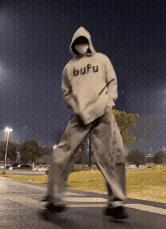
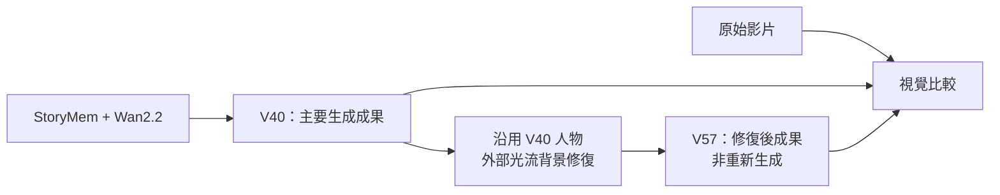
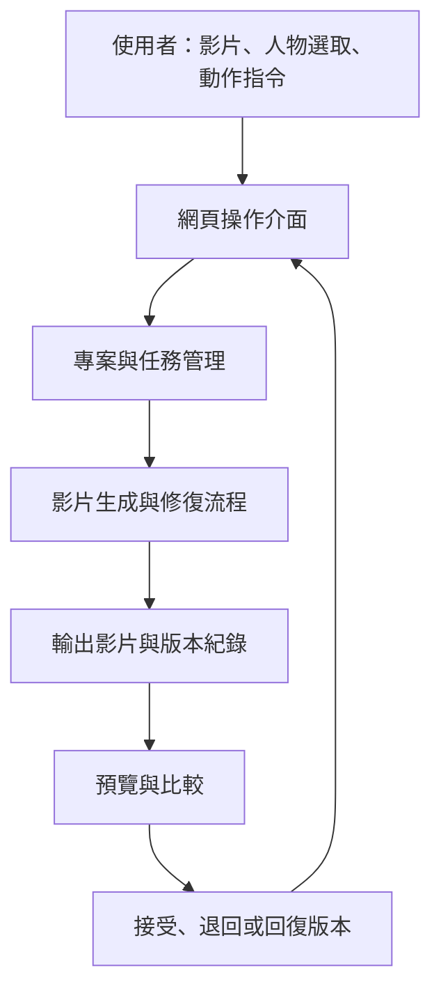
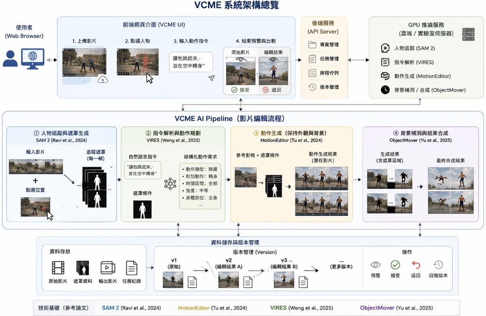
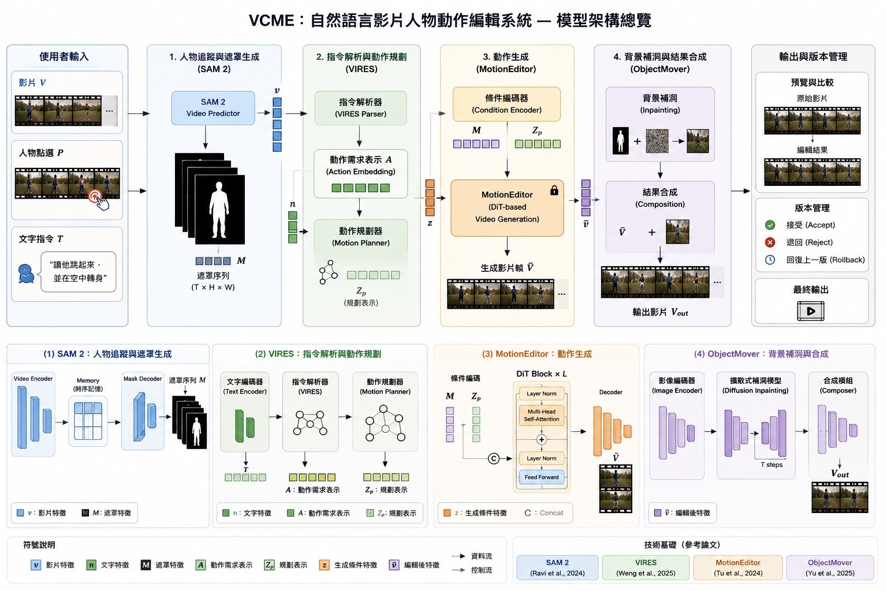

<div align="center">

# VCME: Vibe Character Motion Editor

**自然語言影片人物動作編輯系統**<br>
Natural Language Video Character Motion Editing System

[影片成果](#video-results) · [方法與架構](#architecture) · [版本比較](#version-comparison) · [專題文件](#documents)

</div>

VCME 探索以自然語言修改影片人物動作的工作流程，關注人物動作、外觀保留、背景修復與跨影格連續性。本專題以既有生成模型與處理工具整合實驗，並保存不同階段的輸出，讓動作生成與後續修復的結果可以被分別檢視。

本頁以 **V40：StoryMem + Wan2.2** 作為主要生成成果，搭配 **V57：V40 人物 + 外部光流背景修復** 進行視覺比較。下方並列原始影片、V40 與 V57，展示生成與背景修復兩個階段的成果。

<a id="video-results"></a>
## Video Results｜影片成果

### Main Result · V40

<p align="center">
  <a href="assets/videos/v40.mp4">
    
  </a>
</p>
<p align="center"><strong>StoryMem + Wan2.2 · V40</strong><br><a href="assets/videos/v40.mp4">▶ 觀看完整 MP4</a></p>

### Visual Comparison · 原片與各版本

<table>
  <thead>
    <tr>
      <th align="center">Input · 原始影片</th>
      <th align="center">Ours · V40</th>
      <th align="center">Ours · V57</th>
    </tr>
  </thead>
  <tbody>
    <tr>
      <td align="center"><a href="assets/videos/input.mp4"></a></td>
      <td align="center"><a href="assets/videos/v40.mp4"></a></td>
      <td align="center"><a href="assets/videos/v57.mp4"></a></td>
    </tr>
    <tr>
      <td align="center">原始輸入</td>
      <td align="center">StoryMem + Wan2.2</td>
      <td align="center">V40 人物 + 背景修復</td>
    </tr>
    <tr>
      <td align="center"><a href="assets/videos/input.mp4">▶ 完整影片</a></td>
      <td align="center"><a href="assets/videos/v40.mp4">▶ 完整影片</a></td>
      <td align="center"><a href="assets/videos/v57.mp4">▶ 完整影片</a></td>
    </tr>
  </tbody>
</table>

上方為循環播放的 GIF 動態預覽；點擊可開啟完整 MP4。預覽以相同寬度及 10 fps 製作，不改變影片速度。個別 GIF 的載入時間不同，不保證逐格同步；畫質、音訊與原始流暢度請以 MP4 為準。

<a id="version-comparison"></a>
## Version Comparison｜版本比較

| 版本 | 方法與定位 | 比較重點 |
| --- | --- | --- |
| Input | 原始影片，作為外觀、背景與動作的參考 | 編輯前的角色與場景 |
| V40 | StoryMem + Wan2.2；目前選定的主要生成成果 | 動作表現、人物外觀與時間連續性 |
| V57 | 沿用 V40 人物，加入外部光流背景修復；非重新生成 | 背景穩定性、人物邊界與修復痕跡 |

V40 與 V57 分別代表生成結果及後續背景修復結果，應分開評估人物動作與背景品質。此頁提供定性比較；未附完整推論設定、編輯指令或量化指標，因此不列出未經評測的分數或優劣排名。

<a id="architecture"></a>
## Method & Architecture｜方法與架構

### 成果生成與背景修復流程

新版成果以 StoryMem + Wan2.2 的 V40 為主要展示版本，V57 則沿用 V40 人物進行外部光流背景修復。以下圖示呈現成果檔案所對應的處理階段與版本關係，不涵蓋尚未公開的模型接線與條件輸入細節。



### 互動系統目標

VCME 的產品目標是讓使用者上傳影片、選取人物並輸入動作指令，再預覽與管理生成版本。下圖為系統層級的設計目標，不表示本 repository 已提供可執行的完整前後端。



### 與舊版設計的關係

原始 README 以 SAM 2、VIRES-inspired parser、MotionEditor-inspired generation 與 ObjectMover-inspired composition 描述規劃流程。本頁以 V40／V57 的成果流程說明目前實驗；原始文件中的人物追蹤、指令解析與介面模組選型，保留作為歷史設計紀錄。

<details>
<summary><strong>舊版架構與 AI Pipeline 圖（歷史設計）</strong></summary>

以下圖片保留自原始 repository，供追溯設計演變，並非新版實驗流程。





[閱讀原始 README 存檔](docs/archive/README-original.md)

</details>

## Repository Structure｜資料夾結構

```text
VCME-Vibe-Character-Motion-Editor/
├── README.md
├── assets/
│   ├── videos/                 # README 完整影片：input、v40、v57
│   └── previews/               # 對應的動態 GIF
├── docs/
│   ├── figures/                # 保留的舊版架構圖片
│   └── archive/README-original.md
├── 使用案例圖/
├── 活動圖/
├── 類別圖/
└── *.pdf                       # 專題報告與設計文件
```

目前 repository 主要提供成果展示與系統設計文件，尚未包含可直接執行的完整前後端及生成 pipeline。

## Viewing Locally｜本地瀏覽

```bash
git clone https://github.com/B1229053/VCME-Vibe-Character-Motion-Editor.git
cd VCME-Vibe-Character-Motion-Editor
```

使用支援 Markdown 圖片與 Mermaid 的工具預覽 README，或直接開啟 `assets/videos/` 內的 MP4。上傳時請保留此資料夾的相對路徑，將 `README.md`、`assets/`、`docs/`、專題 PDF 與三個設計圖資料夾放在 repository 根目錄；動態預覽、架構圖與文件連結會使用同一 repository 內的檔案。

<a id="documents"></a>
## Project Documents｜專題文件

以下文件保留原始版本，內容可能包含舊版設計；目前成果與版本定位請以上方說明為準。

- [第一次書面報告](VCME-第一次書面報告.pdf)
- [第二次書面報告](VCME-第二次書面報告.pdf)
- [完整系統分析與設計文件](VCME_自然語言影片人物動作編輯系統：完整系統分析與設計文件.pdf)
- [VCME 詞彙表](VCME詞彙表.pdf)
- [使用案例圖](使用案例圖/) · [活動圖](活動圖/) · [類別圖](類別圖/)

## Team｜專題團隊

**指導教授：** 陳仁暉 教授

**專題成員：** 洪碩廷、顏羽婕、黃靖芳、彭暉紘、王俊傑
